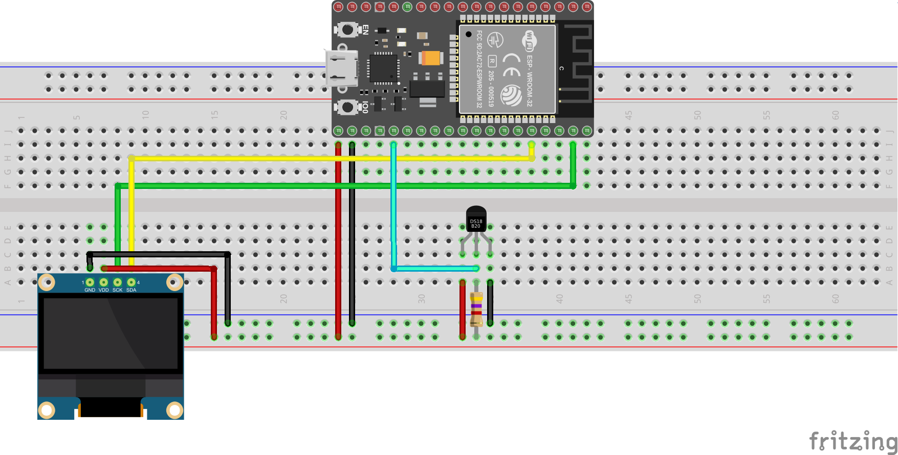

# Fishtank Sensor System

This project implements fishtank sensors using an ESP32
controller. It may work with an ESP8266 as well.

Right now, only temperature is supported, PH and other
sensors will be added in future.

## Install micropython with esptool

esp8266 example:

```
esptool.py  --port /dev/ttyUSB0 --baud 460800 --before default_reset --after hard_reset erase_flash
```

```
esptool.py --port /dev/ttyUSB0 --baud 460800 write_flash --flash_size=detect 0 ~/Downloads/esp8266-20200911-v1.13.bin
```

esp32 example:

```
esptool.py  --port /dev/ttyUSB0 --baud 460800 --before default_reset --after hard_reset erase_flash
```

```
esptool.py --chip esp32 --port /dev/ttyUSB0 write_flash -z 0x1000 ~/Downloads/esp32-idf3-20200902-v1.13.bin
```
## Parts:

1. ESP32 board: https://www.amazon.com/AITRIP-ESP32-DevKitC-Development-ESP32-WROOM-32D-Compatible/dp/B08HMJ1X6W
1. Temperature Sensor: https://www.amazon.com/gp/product/B00M1PM55K
1. SSD1306 Display: https://www.amazon.com/UCTRONICS-SSD1306-Self-Luminous-Display-Raspberry/dp/B072Q2X2LL
1. 4.7kOhm Resistor: https://www.amazon.com/Projects-100EP5124K70-4-7k-Resistors-Pack/dp/B0185FIIVE

## Assemble the Circuit



## Create Password File

FIXME

## upload the code via ampy:

```
pip3 install adafruit-ampy
```

```
ampy -p /dev/ttyUSB0 put fishtank.py
ampy -p /dev/ttyUSB0 put passwords.py
ampy -p /dev/ttyUSB0 put ssd1306.py
ampy -p /dev/ttyUSB0 put adafruit_mqtt.py
ampy -p /dev/ttyUSB0 put boot.py
ampy -p /dev/ttyUSB0 put main.py
```


# Footnotes/Resources

## ssd1306 code and library from:

https://randomnerdtutorials.com/micropython-oled-display-esp32-esp8266/

## DSP example and some code from:

https://randomnerdtutorials.com/micropython-ds18b20-esp32-esp8266/

